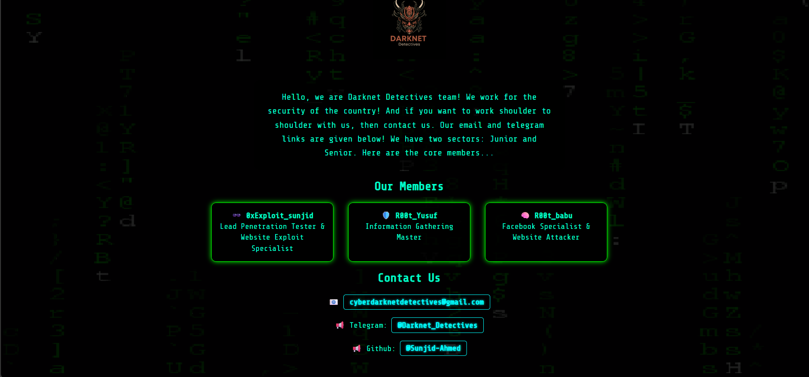

# Darknetdetectives


```markdown
# 🌐 Darknetdetectives - Hacker Team Portfolio Website

Welcome to the official repository of **Darknetdetectives**, a cyber security-driven hacker team focused on defending digital borders and spreading awareness in the world of ethical hacking and penetration testing.

---

## 🚀 Project Overview

**Darknetdetectives** is a sleek, modern portfolio website built for our team to showcase who we are, what we do, and how we contribute to cyber security. This site reflects our vision, members, sectors (Junior/Senior), and ways to collaborate with or join us.

---

## 🔍 Features

- ⚡ Interactive terminal-style landing page
- 🧠 Team introduction with member roles
- 🔐 Sections for Junior and Senior hacker divisions
- 📬 Secure contact section (email, Telegram)
- 🎯 Responsive and lightweight design
- 🖥️ Built with performance and style in mind

---

## 🛠️ Tech Stack

- **HTML5 / CSS3**
- **JavaScript (Vanilla)**
- **Terminal UI Simulations**
- **Font**: Share Tech Mono
- **Deployment**: GitHub Pages

---

## 📂 Repository Structure

```

Darknetdetectives/
├── index.html
├── style.css
├── script.js
├── assets/
│   └── images, sounds, icons
└── README.md

````## 💡 How to Use

1. **Clone this repository**:
   ```bash
   git clone https://github.com/Sunjid-Ahmed/Darknetdetectives.git
````

2. **Open in browser**:
   Open `index.html` using any modern web browser.

3. **Deploy via GitHub Pages** *(optional)*:

   * Go to repo Settings → Pages → Deploy from `main` branch → root.

---

## 👥 Join the Team

We are always looking for passionate cyber security learners and professionals. If you want to work shoulder-to-shoulder with us:

📩 **Email**: [darknetdetectives@protonmail.com](mailto:darknetdetectives@protonmail.com)
💬 **Telegram**: [t.me/DarknetDetectives](https://t.me/DarknetDetectives)

---

## 🤝 Contributing

Want to contribute? Feel free to fork the repository and submit a pull request!

---

## ⚖️ License

This project is licensed under the [MIT License](LICENSE).

---

## 🧠 Credits

Created and maintained by the **Darknetdetectives Team**.
Powered by passion for ethical hacking and cyber awareness.

---

> “We work for the security of the country!”

```

---

Would you like me to create the actual files (`index.html`, `style.css`, etc.) and package them into a ZIP or GitHub repo for you?
```
